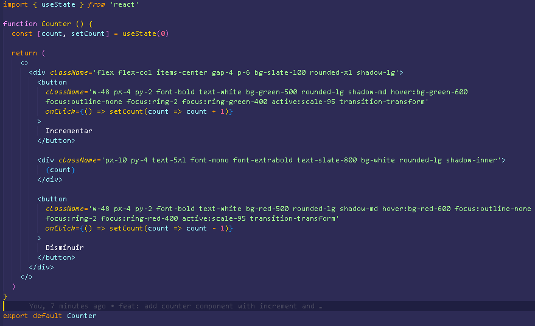
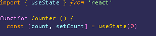
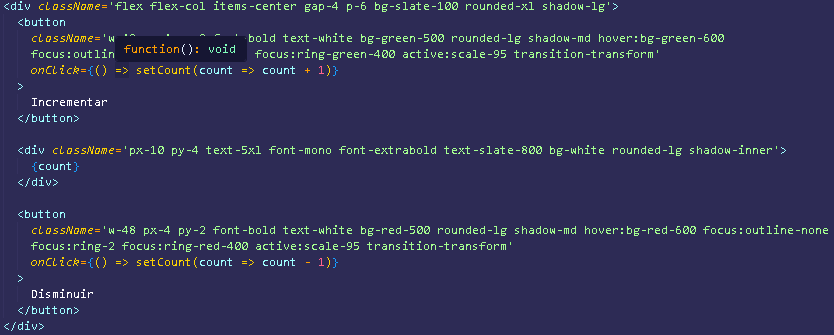

# 🧮 Aplicación de Contador

Una aplicación de contador moderna e interactiva construida con React y estilizada con TailwindCSS. Este componente simple demuestra conceptos basicos fundamentales de React, incluyendo gestión de estado y manejo de eventos.

## 📝 Descripción

Este proyecto muestra una elegante implementación de contador que permite a los usuarios incrementar y decrementar valores a través de una interfaz intuitiva. El contador cuenta con animaciones suaves y un diseño responsivo que funciona en cualquier tamaño de pantalla.

## ✨ Características Principales

- Funcionalidad para incrementar y decrementar con una visualización clara
- Diseño responsivo que se adapta a cualquier tamaño de pantalla
- Interfaz de usuario moderna con controles intuitivos
- Animaciones y transiciones suaves
- Diseño accesible con estados de enfoque y contraste de color adecuados
- Estructura de código React limpia y mantenible

## 🛠️ Tecnologías Utilizadas

- [React](https://react.dev/) - Biblioteca para construir interfaces de usuario
- [Vite](https://vitejs.dev/) - Herramienta de desarrollo frontend de nueva generación
- [TailwindCSS](https://tailwindcss.com/) - Framework CSS basado en utilidades
- [ESLint](https://eslint.org/) - Herramienta para calidad y consistencia del código

## 🚀 Instalación y Configuración

Sigue estos pasos para configurar el proyecto en tu máquina local:

```bash
# Clonar el repositorio
git clone [repository-url]

# Navegar al directorio del proyecto
cd programacion-4

# Instalar dependencias
npm install

# Iniciar el servidor de desarrollo
npm run dev
```

## 💻 Uso

El componente Counter está diseñado para ser fácilmente integrado en cualquier aplicación React:

```jsx
import Counter from './components/Counter'

function App() {
  return (
    <div className="container mx-auto">
      <h1>Mi Aplicación de Contador</h1>
      <Counter />
    </div>
  )
}
```

## 🧩 Estructura del Componente

### Gestión de Estado

El componente Counter utiliza el hook `useState` de React para gestionar el estado del contador:

```jsx
import { useState } from 'react'

function Counter() {
  const [count, setCount] = useState(0)
  
  // Lógica y renderizado del componente...
}
```

### Manejadores de Eventos

El componente incluye manejadores para incrementar y decrementar el contador:

```jsx
// Manejador de incremento
const handleIncrement = () => setCount(prevCount => prevCount + 1)

// Manejador de decremento
const handleDecrement = () => setCount(prevCount => prevCount - 1)
```

### Renderizado del Componente

El componente Counter renderiza una interfaz de usuario con dos botones y un área de visualización:

```jsx
return (
  <div className="flex flex-col items-center gap-4 p-6 bg-slate-100 rounded-xl">
    <button onClick={handleIncrement}>Incrementar</button>
    <div className="counter-display">{count}</div>
    <button onClick={handleDecrement}>Disminuir</button>
  </div>
)
```

## 📸 Capturas de Código

### Estructura Principal del Componente



### Implementación de la Gestión de Estado



### Implementación de los Botones



## 🎨 Detalles de Estilo

El componente utiliza clases de utilidad de TailwindCSS para un diseño limpio y moderno:

- **Esquema de Colores**: Verde para incrementar, rojo para decrementar, con estados de hover apropiados
- **Tipografía**: Fuentes limpias y legibles con tamaños adecuados para diferentes elementos
- **Diseño**: Diseño centrado basado en tarjetas con espaciado apropiado
- **Animaciones**: Efectos sutiles de transformación al presionar botones
- **Accesibilidad**: Anillos de enfoque y ratios de contraste de color adecuados

## 📋 Scripts Disponibles

- `npm run dev` - Iniciar el servidor de desarrollo
- `npm run build` - Construir la aplicación para producción
- `npm run lint` - Ejecutar ESLint para verificar problemas de calidad del código
- `npm run preview` - Previsualizar la compilación de producción localmente

## 🔍 Detalles de Implementación

El componente Counter demuestra varias buenas prácticas de React:

1. **Componentes Funcionales**: Uso de componentes funcionales modernos de React
2. **Hooks**: Aprovechamiento de useState de React para la gestión del estado
3. **Manejo de Eventos**: Implementación adecuada de manejadores de eventos para interacciones del usuario
4. **Flujo de Datos Unidireccional**: Seguimiento de los principios de flujo de datos de React
5. **Aislamiento de Componentes**: Creación de un componente autocontenido y reutilizable
